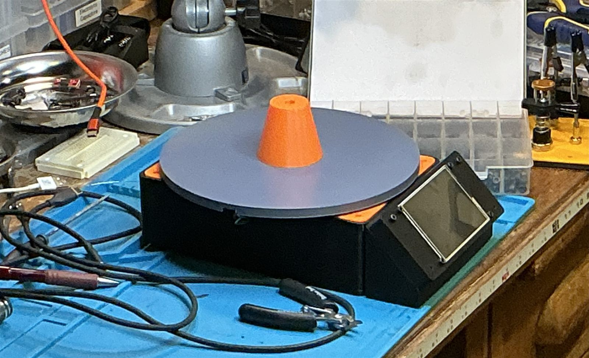
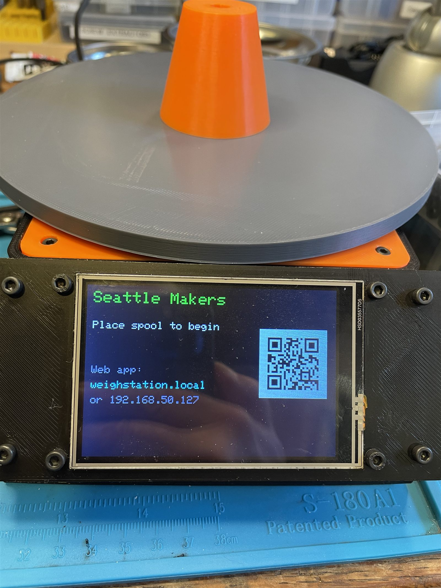

# Filliment Scale

  
   
  

Firmware for the Seattle Makers filament weigh station — a **self-contained**
NFC + load-cell scale for the 3D-printing lab.

Place a spool on the scale: it reads the OpenPrintTag (OPT) NFC tag, weighs the
spool, and records the remaining filament **locally on the device** — no external
server. A built-in web app handles inventory, onboarding new spools, reordering,
backup/restore, and scale calibration; usage history is kept as an append-only
event log in on-device flash.

- **Hardware:** SparkFun Thing Plus ESP32-S3, PN5180 NFC (ISO15693), NAU7802
  load-cell ADC, 3.5" ILI9488 SPI TFT (480×320), passive piezo buzzer, onboard
  WS2812 NeoPixel.
- **Firmware:** PlatformIO + Arduino, FreeRTOS tasks (NFC / scale / display /
  sync + web app). Local storage on LittleFS + NVS.

## Docs

- [`docs/build-guide.md`](docs/build-guide.md) — build one from scratch: parts, printing, wiring, flashing, first bring-up
- [`DEVELOPMENT.md`](DEVELOPMENT.md) — set up, build, and flash
- [`docs/user-manual.md`](docs/user-manual.md) — operation (members + admins)
- [`hardware/netlist.md`](hardware/netlist.md) — wiring diagram + pinout
- [`docs/design/sd-local-ecosystem.md`](docs/design/sd-local-ecosystem.md) — the
  local-storage architecture

> **History:** this project originally synced to Spoolman (and kept history in
> Prometheus). It is now standalone — Spoolman and Prometheus have been removed
> and replaced by on-device storage and the built-in web app.

## License

[GPL-3.0-or-later](LICENSE). Commercial use, including selling assembled
units or a modified firmware, is fine — but any distributed derivative
(firmware, the enclosure `.scad` files, or this repo's own docs) must stay
under the same license and come with source. Firmware, tools, and hardware
source files each carry an `SPDX-License-Identifier: GPL-3.0-or-later`
header; that's the convention to follow in any new file.

Third-party libraries pulled in via `platformio.ini` and the vendored copy
of `lib/PN5180-Library` (LGPL-2.1) keep their own upstream licenses —
check the library's own `LICENSE` before assuming GPL terms apply to it.
