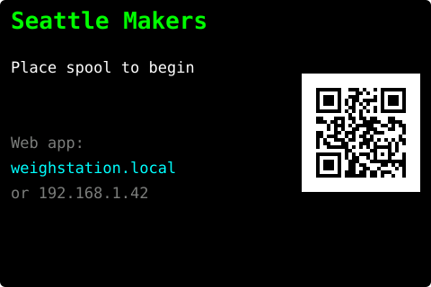
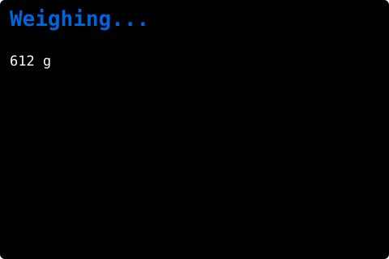
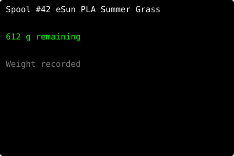
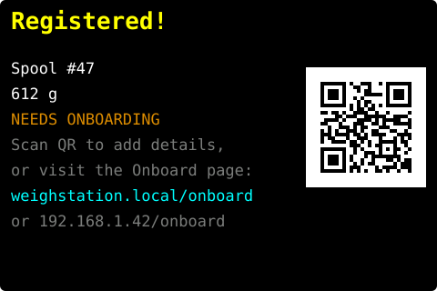
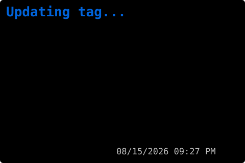
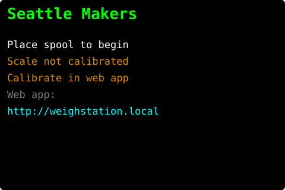
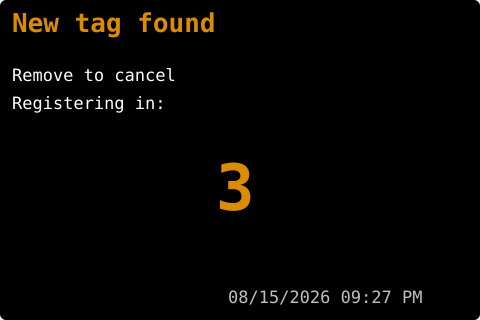
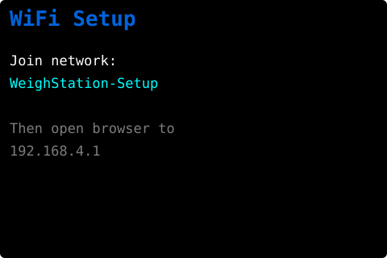

# Weigh Station — User Manual

The Weigh Station is a self-contained filament inventory tool for the Seattle
Makers 3D-printing lab. Place a spool on the scale; it reads the NFC tag, weighs
the spool, and records the remaining filament **on the device**. A built-in web
app (`http://weighstation.local/`) shows inventory and history, onboards new
spools, flags reorders, and takes backups. There is no external server.

---

## For Members: Weighing a Spool

1. **Place the spool on the scale.** The NFC reader and load cell activate
   immediately — no button press needed.
2. **Wait for the display to settle.** It shows the spool number, material, and
   remaining weight for a second or two.
3. **Remove the spool.** The display returns to the idle screen.

That's it — the reading is saved locally, and a weigh entry is added to the
spool's history.

### What the display shows

The 3.5" screen shows one of these, depending on what's happening:

| Display | Meaning |
|---|---|
|  | **Idle, ready** — place a spool to begin |
|  | **Weighing** — reading the load cell |
|  | **Done** — spool number, material, and remaining weight recorded locally |
|  | **New spool registered** — fill in the material details in the web app (see *New Spools* below) |
|  | **Updating tag** — writing updated filament data back to the NFC tag |
|  | **Not calibrated** — shown on idle until the scale is calibrated (weights are unreliable until then) |

### Status light (NeoPixel)

| Color | Meaning |
|---|---|
| Dim green | Idle, ready |
| Blue | Working (WiFi setup, weighing, writing tag) |
| Green | Spool weighed and saved |
| Yellow | Spool registered but needs details entered in the web app |
| Amber (blinking, accelerating) | New-tag countdown — remove the spool to cancel |
| Red | Tag read error — reposition the spool |

---

## For Members: New Spools

When you place a spool with a **blank NFC tag** on the scale:

1. The display shows a **5-second countdown** — "New tag found / Remove to
   cancel / Registering in: 5…"

   

2. **Remove the spool within 5 seconds** to cancel, or **leave it in place** to
   proceed.
3. The station formats the tag and creates a placeholder record on the device.
   The display shows `Registered! / Spool #N / Add details in web app`.

   

4. **Open the web app and fill in the material details** for that spool — see
   *Onboarding a spool* below.

Once the details are saved, the NFC tag is written with the real data — either
right away if the spool is still on the scale, or the next time it's placed.

### Onboarding a spool (web app)

1. With the spool on the scale, browse to `http://weighstation.local/` on any
   phone or laptop on the same network.
2. Open **Onboard**. Pick the **vendor**, **material**, **color**, and **spool
   profile** (the profile fills in the empty-spool tare and nominal weight). You
   can also capture the tare from a matching empty spool with **Capture tare**.
3. **Save & write tag.** The full OpenPrintTag data (identity, print temps,
   weights) is written to the tag and the record is saved.

### Applying an NFC tag to a new spool

Use an OpenPrintTag MK1 sticker. Peel and apply to the flat hub face of the
spool — away from the filament windings, centered so it sits over the NFC reader
when placed on the scale. Press firmly for 5 seconds.

**Do not reuse tags.** Peeling a tag risks cracking the foil antenna invisibly.
New tag for every new spool.

### Pre-tagged spools (e.g. Prusament)

Some spools arrive with an NFC tag already applied (genuine Prusament, or spools
tagged by another maker's setup). The station recognizes these as legitimate and
creates a local record from the data already on the tag — no countdown, no
blank-tag flow. It then weighs and records normally.

---

## For Administrators: Initial Setup

Full build/flash steps are in [`DEVELOPMENT.md`](../DEVELOPMENT.md); a short
version follows.

### 1. Hardware assembly

Wire the components per [`hardware/netlist.md`](../hardware/netlist.md). The
NAU7802 connects via a Qwiic cable; the PN5180 NFC module and the ILI9488 TFT
display share the SPI bus.

### 2. Flash the firmware

```bash
pio run --target upload
```

### 3. First-time WiFi setup

On first boot the display shows the WiFi setup screen:



1. On any phone or laptop, join the `WeighStation-Setup` WiFi network.
2. A captive-portal page opens automatically (or browse to `192.168.4.1`).
3. Select your WiFi network and enter the password.
4. Submit. The device connects to the lab network and the display shows the idle
   screen with its address (`http://weighstation.local/`).

If no network is configured (or it can't be reached), the station falls back to
its own `WeighStation` access point so the web app stays reachable — the idle
screen shows the SSID and address to use.

### 4. Scale calibration (web)

The scale reads raw counts until calibrated; the idle screen shows **"Scale not
calibrated"** until you do this:


1. With the spool on/off as directed, browse to `http://weighstation.local/` and
   open **Calibrate**.
2. **Step 1 — Zero:** clear the scale, then click **Zero (tare)**.
3. **Step 2 — Calibrate:** place a known weight, type its exact mass in grams,
   then **Set calibration**.

The banner clears when it takes. (Serial `ZERO` / `CAL <grams>` at 115200 baud
still work as a fallback.)

---

## For Administrators: Ongoing Maintenance

### The web app

`http://weighstation.local/` provides:

- **Inventory** — remaining filament by material; the spool currently on the scale.
- **Spools** — the full list; click a spool for its weigh history + a remaining-over-time sparkline (with CSV export).
- **Onboard** — fill in details for a new/blank spool.
- **Reorder** — standard-stock items at or below threshold; download a CSV to place the order.
- **Config** — edit the vendor/material/color/spool-profile/stock-item tables.
- **Backup** — download the event log; restore from an uploaded backup.
- **Calibrate** — the scale calibration workflow above.

### Changing the WiFi network

**Option A — web (device currently connected):** browse to
`http://weighstation.local/reset`. The device reboots and opens the
`WeighStation-Setup` AP; connect and reconfigure as in initial setup.

**Option B — power cycle (device unreachable):** power-cycle it. If stored
credentials fail, the captive portal opens for **5 minutes** — connect within
that window and reconfigure. (Holding the BOOT button for 3 s at power-on also
clears WiFi credentials.)

### Recalibrating / backups

Recalibrate any time via the **Calibrate** page. Take periodic **Backup**
downloads (and, once the SD card is wired, automatic snapshots) so history
survives a device swap.

---

## Troubleshooting

### Device won't connect to WiFi

- Power-cycle the device and connect to `WeighStation-Setup` within 5 minutes
  to reconfigure.
- If the SSID list in the portal is empty, wait ~30 seconds for the scan and
  refresh the page.

### NFC tag not reading ("Read error")

- Reposition the spool so the tag is centered over the reader.
- Check that the tag sticker is fully adhered with no air bubbles near the center.
- If the error persists, the tag antenna may be damaged — replace the tag.

### Scale reads zero or wildly wrong values

- Recalibrate: open **Calibrate**, **Zero** with the platform clear, then
  **Set calibration** with a known weight.
- Check that the load cell wiring hasn't shifted (particularly E+ / E− polarity).

### Display is blank

- Check the TFT's SPI wiring — CS (GPIO 15), DC (GPIO 16), RST (GPIO 17), and the
  shared MOSI/SCK.
- Make sure the backlight (`LED` pin) is powered (tied to 3.3 V) — the panel
  shows nothing without it.
